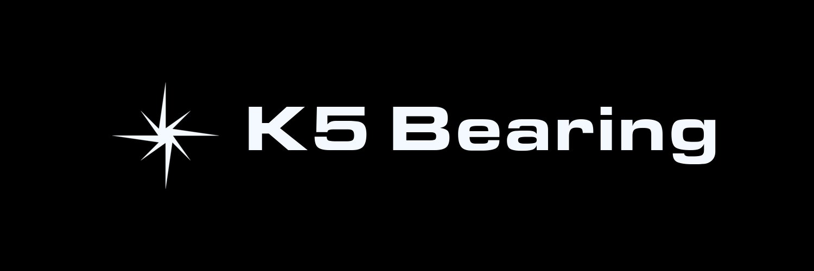

<p align="center">
  
</p>

<p align="center">
  Notes on the body — how we move it, and how we bow it.<br>
  <a href="LICENSE">Open source · MIT</a>
</p>

**K5 Bearing** is a plain, text-based site on three pillars: the **body**, **motion**, and
**Karaite prayer**. Effort and reverence run through the same flesh. The whole aim is
simple — keep your bearing.

## Run it

A single, unstyled HTML page — no CSS, no build step, no dependencies. Open `index.html`,
or serve the folder:

```
python3 -m http.server 8000     # then open http://localhost:8000
```

## Repository

```
index.html     the whole site — plain HTML, browser default styling
assets/        brand: pinwheel mark, header banner
```

## About

Unformatted on purpose: no stylesheet, just text as the browser renders it. The Karaite
section is meant to be accurate and respectful — Karaite Judaism keeps its worship close to
the Tanakh, the written word. Everything is easy to change: it all lives in `index.html`.

## License

Open source under the [MIT License](LICENSE) — free to use, modify, and share.
